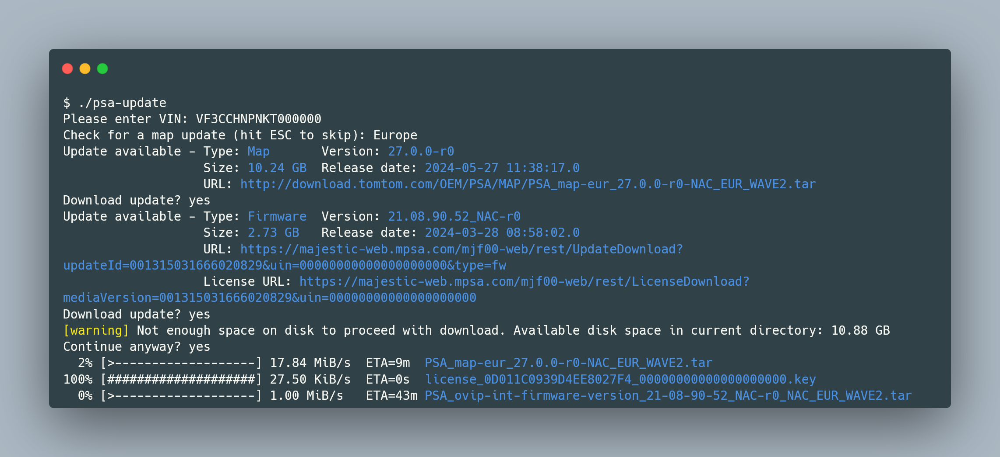

# psa-update

CLI alternative to Stellantis (Peugeot / Citroën / DS / Opel) update applications for car infotainment system (NAC / RCC firmware and navigation maps), hopefully more robust.



`psa-update` offers mostly the same features as the official firmware/map update application proposed by the car vendor, except that it does not format the USB flash drice that has to be used to upload the firmware/map update to the car.

Updates are exclusively downloaded from the official Stellantis website.

Features:

- Download updates of RCC / NAC firmwares, and navigation maps (NAC only)
- Resume downloads in case of failure
- Prepares USB flash drive for car infotainment system update
- Lightweight self-contained executable that can run on multiple platforms: Windows, Linux, MacOS

## Usage

The command line executable can be invoked in a terminal:

```shell
$ psa-update
```

This will interactively ask for vehicle VIN, check for available NAC/RCC/map updates, and extract updates to a USB flash drive.

Once copied to the USB drive, the update can be applied on the car infotainment system following stellantis instructions.

For example for Peugeot:

- [RCC instructions](https://web.archive.org/web/20220719220945/https://media-ct-ndp.peugeot.com/file/38/2/map-software-rcc-en.632382.pdf)
- [NAC instructions](https://web.archive.org/web/20230602131011/https://media-ct-ndp.peugeot.com/file/38/0/map-software-nac-en.632380.pdf)

### Advanced usage

The command line executable supports multiple arguments, refer to the help message for more information.

```console
$ psa-update --help
CLI alternative to Peugeot/Citroën/Opel/DS update applications for car infotainment system (NAC/RCC firmware and navigation maps), hopefully more robust. Supports for resume of downloads.

Usage: psa-update [OPTIONS] [VIN]

Arguments:
  [VIN]  Vehicle Identification Number (VIN) to check for update

Options:
      --map <map>            Sets the map to check for update. Supported maps:
                              - afr: Africa
                              - alg: Algeria
                              - asia: Asia
                              - eur: Europe
                              - isr: Israel
                              - latam: Latin America
                              - latam-chile: Latin America Chile
                              - mea: Middle East
                              - oce: Oceania
                              - russia: Russia
                              - taiwan: Taiwan
      --silent               Sets silent (non-interactive) mode
      --download             Automatically proceed with download of updates. Previous downloads will be resumed.
      --extract <extract>    Location where to extract update files. Should be the root of an empty FAT32 USB drive.
      --sequential-download  Forces sequential download of updates. By default updates are downloaded concurrently.
  -h, --help                 Print help
  -V, --version              Print version
```

A silent (non-interactive) mode can be activated using the `--silent` flag.

For example, to check for updates and automatically download and extract them to a USB drive, you can use the following command:

```shell
$ psa-update --silent --download --extract /path/to/usb/drive
```

## Requirements

For the transfer of updates to the car, a USB flash drive is required:

- Recommended size is **32 GB**. Although most updates are smaller than 16 GB, some navigations maps can be larger than 16 GB.
- It must be formatted as **FAT32** and **empty**.

> [!NOTE] 
> When using Windows, if the USB flash drive is larger than 32 GB, it is not possible to format it using FAT32. Alternatives are:
>
> - Create a 32 GB partition and format if as FAT32 and leave the rest unformatted.
> - Use a third-party tool to format the USB flash drive using FAT32. The official vendor application presumably uses [fat32format from Ridgecrop Consultants Ltd](http://ridgecrop.co.uk/index.htm?guiformat.htm) to achieve this.

On Linux, OpenSSL is required. On Windows and MacOS, nothing is required, the operating system TLS framework is used.

## Install

Binaries are available for Windows (x86-64), Linux (x86-64) and MacOS (x86-64 and AArch64/ARM64) in the [releases](https://github.com/zeld/psa-update/releases) section.

To install, simply download and extract the `psa-update` executable.

For other platforms the project can be built from source code (see below).

## Build from source

To build and run from source code using stable rust compiler toolchain (version 1.81+):

```shell
$ git clone https://github.com/zeld/psa-update.git
$ cd psa-update
$ cargo build --release
$ ./target/release/psa-update --version
```

## Other tools

The table below quickly compares `psa-update` with other available tools I'm aware of:

| Tool                                                                                        | Type        | Platform                | Language | Download updates | Format USB drive | Extract to USB Drive |
| ------------------------------------------------------------------------------------------- | ----------- | ----------------------- | -------- | ---------------- | ---------------- | -------------------- |
| Official (Peugeot Update, Citroën Update, Opel Update, DS Update)                           | Desktop app | Windows / MacOS         | Multi    | ✅ (with resume) | ✅              | ✅                   |
| [psa-update](https://github.com/zeld/psa-update)                                            | Terminal    | Windows / Linux / MacOS | English  | ✅ (with resume) | ❌              | ✅                   |
| [Peugeot Update alternative](https://github.com/bagou9/Peugeot-Update-logiciel-alternatif/) | Desktop app | Windows                 | French   | ✅ (with resume) | ❌              | ✅                   |
| [peugeot-tools](https://github.com/sbz/peugeot-tools)                                       | Terminal    | ?                       | English  | ✅ (with resume) | ❌              | ❌                   |

## Proxy

Download of updates is possible behind a proxy provided the `http_proxy` and `https_proxy` environment variables are correctly set.

Using a Linux or MacOS terminal:

```shell
export http_proxy=<host>:<port>
export https_proxy=<host>:<port>
```

Using a Windows CMD prompt:

```cmd
SET http_proxy=<host>:<port>
SET https_proxy=<host>:<port>
```

## Logging

Logging can be enabled using the `RUST_LOG` variable. For exemple to enable `debug` log level:

```shell
RUST_LOG="debug" ./psa-update
```

## Credits

- Inspired from the Linux script in this French [forum post](https://www.forum-peugeot.com/Forum/threads/app-peugeot-update-logiciel-alternatif-multi-os-v1-5-26-08-2021.119707/)
- For the list of navigation maps, and associated content, this French [forum post](https://forum-auto.caradisiac.com/topic/129967-le-nac-du-3008-ii-et-de-tous-les-v%C3%A9hicules-psa-lisez-en-premier-la-page-n%C2%B012/)
- List of firmware and map updates on [this site](https://sites.google.com/view/nac-rcc/)
